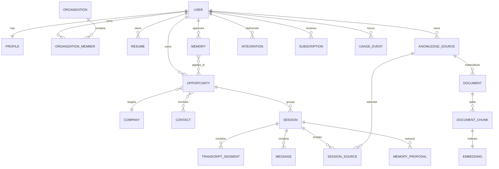

# Torvi: founder blueprint

Research snapshot: 22 August 2026  
Decision horizon: competitive v1 and the following 12 months

## Executive decision

Do not build an “undetectable answer machine.” That category is crowded, ethically fragile, easy to copy, and full of trust problems. Build the first **truth-grounded conversation memory system** for high-stakes professional conversations.

The initial customer should remain an active job seeker in a multi-round professional or technical interview loop. The first promise is simple:

> Walk into every round prepared, get concise evidence-backed prompts while you speak, and leave with a smarter plan for the next conversation.

The wedge is not the overlay. It is the continuity of context across **Before → During → After**:

- Before: a verified story bank, role brief, interviewer/round context, likely questions, and relevant documents.
- During: question detection, short-first suggestions, source confidence, and consistency checks against prior rounds.
- After: a transcript only when saved, answer review, commitments, follow-up draft, and next-round memory.

The moat is a user-controlled Personal Context Graph: facts, stories, metrics, projects, preferences, sources, and prior conversation commitments. Every suggestion should be explainable. If evidence is missing, the product gives a structure rather than inventing a life story.

## How to read the evidence

This report uses three evidence levels:

- **Verified product fact:** present in an official product page, documentation, support article, store listing, or directly observable public flow.
- **Vendor claim:** a performance, accuracy, user-count, language-count, privacy, or compatibility claim made by the company but not independently audited here.
- **Inference:** a product or business conclusion drawn from multiple signals. It is labeled as such.

Review sites and Reddit are directional, not ground truth. This category has obvious affiliate, competitor, and coordinated-posting incentives. Repeated complaints matter as discovery leads, but they should be validated in customer interviews and instrumented usability tests.

## Competitive research

### Cluely

**Verified product facts.** Cluely presents a desktop-first, no-meeting-bot assistant that listens to device audio, can use visible screen context, and returns live answers in a movable overlay. It also creates notes, action items, and follow-up material. The homepage demonstrates a manual Cmd/Ctrl + Enter assist action, follow-up questions, recap, and support for Zoom, Slack, Webex, Teams, and Google Meet. Its public pricing page lists Starter, Pro, and a much more expensive Pro + Undetectability tier. The mobile page presents an iPhone app; Android was not verified in this research. See the [Cluely homepage](https://cluely.com/), [pricing](https://cluely.com/pricing), [mobile page](https://cluely.com/mobile), [pre-call documentation](https://docs.cluely.com/feature/precall), and [post-call documentation](https://docs.cluely.com/feature/postcall).

**Vendor claims.** Cluely markets 12+ languages, 300 ms transcription, 95% transcription accuracy, screen-share exclusion, and no bot in the participant list. These are marketing claims, not independent benchmarks. Its public documentation has also drifted: an older [limitations page](https://docs.cluely.com/feature/limitations) conflicts with newer mobile and product pages, so current behavior must be tested per platform and release.

**Experience.** The strongest idea is interaction compression. A small overlay, a memorable hotkey, an obvious “what should I say?” action, and a short answer remove setup and navigation while a conversation is moving. Cluely also connects pre-call attendee research and prior conversation memory to the live experience, described in [People Search + Memory](https://cluely.com/blog/people-search-live). That makes the assistant feel situational rather than like a detached chatbot.

**Business and growth.** Cluely owns a sharp “during, not after” contrast against traditional notetakers. It uses provocative category language, comparison pages, topical education, demos, and social virality. The founder’s own [virality essay](https://cluely.com/blog/virality) makes a useful admission: reach does not create retention, and a 50-million-view meme can still produce very few downloads. Its [AI-notetaker guide](https://cluely.com/blog/ai-notetaker-guide), [Cluely vs Otter](https://cluely.com/blog/cluely-vs-otter), and [Cluely vs Granola](https://cluely.com/blog/cluely-vs-granola) show a disciplined SEO strategy around comparison intent.

**Weaknesses and risks.** “Undetectable” positioning attracts attention but creates employer, interview-integrity, consent, and platform-policy risk. Screen-share exclusion can only be best effort across changing apps and operating systems. The product’s broad meeting positioning also makes its interview preparation and evidence discipline less explicit than interview-native competitors.

**What to learn without copying.** Make the fastest useful action available from anywhere; show context without opening a dashboard; prepare attendee and document context before the call; deliver a one-glance first response. Do not copy covert-use language or promise universal invisibility.

### Final Round AI

**Verified product facts.** Final Round AI offers an interview-centered suite: Interview Copilot, mock interviews, resume tooling, job workflows, and post-session feedback. Its public getting-started flow is explicit: add a resume, add a position/job description, launch the interview, and review the report. The native app is marketed for Mac and Windows and across Zoom, Meet, Teams, and coding environments. Official pages describe manual Smart Mode and automatic question detection, behavioral and technical workflows, session reports, and resume/JD personalization. See the [homepage](https://www.finalroundai.com/), [getting-started flow](https://app-preview.finalroundai.com/app/v2/started), [FAQ](https://www.finalroundai.com/frequently-asked-questions), [product guide](https://www.finalroundai.com/blog/what-is-final-round-ai), and [copilot guide](https://www.finalroundai.com/blog/how-to-use-final-round-ai-interview-copilot).

**Vendor claims and inconsistencies.** Language counts, free access, and prices vary across official pages, region-specific offers, and promotions. Exact price should therefore be treated as time- and region-sensitive. This inconsistency is itself a product lesson: a customer should be able to understand cost, renewal, refund eligibility, and remaining minutes before entering payment details.

**Experience.** Final Round’s strongest idea is the job-specific workflow. Resume + position is not hidden inside a generic profile; it is a prerequisite to the live copilot. It also creates a larger career workspace around the interview, which improves acquisition and retention beyond a single call.

**Business and growth.** Its [blog](https://www.finalroundai.com/blog) is a large organic-acquisition engine spanning role questions, company questions, salary topics, calculators, guides, and competitor comparisons. This is closer to a search marketplace than a conventional startup blog.

**Complaints and limitations.** Final Round’s own [review article](https://www.finalroundai.com/blog/final-round-ai-review) acknowledges preparation needs, high monthly cost, and weaker precision for expert coding. Current [Trustpilot reviews](https://www.trustpilot.com/review/finalroundai.com) include both positive outcomes and recurring complaints about refund/support handling, latency, long or generic answers, and confusing expectations. These reviews are anecdotal, but the repeated themes are suitable for usability and support research. Its public [refund policy](https://www.finalroundai.com/refund-policy) should be compared with checkout copy for consistency.

**What to learn without copying.** Treat resume and job context as part of session launch; own the full career workflow; make mock practice feed the live copilot; publish high-intent tools and role/company guides. Do differently: short, source-visible answers; transparent limits; expert-mode evaluation; no-card product proof.

### Verve AI / Verve Copilot

**Verified product facts.** Verve is strongly interview-focused. Its quickstart supports a browser route through Chrome-family browsers and a desktop route. Users choose a domain and profile, including role, seniority, company, and resume. Public docs describe general, coding, software engineering, data, cloud, AI/security, online assessment, product, and work-related modes. Its pricing comparison includes question banks, mock interviews, reports, session sharing, screen drag capture, and multiple transcription languages. See [Verve pricing](https://www.vervecopilot.com/pricing), [quickstart](https://docs.vervecopilot.com/quickstart), [mobile](https://www.vervecopilot.com/mobile), and [about](https://www.vervecopilot.com/about).

**Platform strategy.** Verve has browser and desktop paths plus an iPhone second-screen companion. The phone can show suggestions while the computer handles the interview context. Android was not verified in this research.

**Vendor claims.** Public pricing markets access to current OpenAI, Anthropic, and Google models and 55+ transcription languages. Model availability can change and should not become the customer-facing value proposition; quality, latency, and grounding are what users experience.

**Experience.** Verve’s strongest product idea is domain selection. Coding, data, cloud, product, and assessment workflows need different response formats. Its playground and reusable profiles reduce first-live-session risk.

**Weaknesses and research limits.** Credible independent review coverage is sparse. Reddit mentions are low-volume and sometimes promotional. That makes product-quality conclusions low confidence. More settings and model/domain selectors can also increase cognitive load at exactly the moment a user needs simplicity.

**What to learn without copying.** Use mode-specific answer structures; offer a safe playground; make profiles reusable; support a second-screen experience. Hide model plumbing behind outcome-oriented modes and automatically choose defaults.

### LockedIn AI

**Verified product facts.** LockedIn spans interviews and professional conversations. Its docs describe Interview, Professional Meeting, Online Assessment, and Phone modes, plus custom prompts/presets, model selection, screenshot/coding help, document selection, web search, teleprompter, voice output, hotkeys, mock interviews, history, reports, and a “Duo” human-helper concept. Official support describes macOS, Windows 11, iOS, and Android availability through different web/desktop/mobile paths. See the [homepage](https://www.lockedinai.com/), [documentation](https://docs.lockedinai.com/docs), [using guide](https://docs.lockedinai.com/docs/using), [desktop page](https://www.lockedinai.com/desktop-app), [platform FAQ](https://support.lockedinai.com/faq/does-lockedin-ai-copilot-for-live-online-interviews-work-on-android-mobile-and-windows-11-laptop/), and [Chrome listing](https://chromewebstore.google.com/detail/lockedin-ai/kfhkeghcignojkdcnemgcggojlmneema?hl=en-US).

**Pricing.** LockedIn mixes subscription and credit language. Its [support material](https://support.lockedinai.com/using-lockedin-ai/) explains different credit consumption by mode and credits that do not expire. That can be flexible, but it also creates mental accounting during live use.

**Vendor claims.** The homepage markets 99+ languages, a large user base, and strong ratings. Those claims were not independently audited here.

**Growth.** LockedIn uses a broad surface area, Chrome distribution, affiliate/referral mechanics, and a performance-based [creator program](https://analytics.lockedinai.com/). This is a scalable short-form distribution play.

**Complaints and trust signals.** [Trustpilot’s LockedIn page](https://www.trustpilot.com/review/lockedinai.com) currently shows a guideline-breach warning rather than a normal rating. Individual reviews and Reddit threads mention bugs, generic answers, session constraints, and refund friction, but many Reddit discussions appear coordinated or competitor-promotional. Treat the warning as verified and the individual product complaints as low-confidence discovery inputs.

**What to learn without copying.** A single assistant can serve multiple professional conversation modes; document selection and custom presets are valuable; mobile/web/desktop coverage expands use cases. Do differently: simple pricing, trustworthy reviews, fewer controls, automatic routing, transparent session health, and a narrow initial promise.

## Competitive feature matrix

Legend: **Yes** = verified in official public material; **Limited** = present with platform or workflow constraints; **Claim** = vendor performance/coverage claim not audited here; **Unclear** = not publicly verified in this research.

| Feature | Cluely | Final Round AI | Verve AI | LockedIn AI | Opportunity |
|---|---|---|---|---|---|
| Interview copilot | Yes | Yes | Yes | Yes | Commodity; win on reliability and grounding |
| General meeting copilot | Yes | Limited | Limited | Yes | Retain interview wedge, expand after PMF |
| Sales copilot | Broad meeting fit | Limited | Limited | Professional mode | Build CRM-native mode later |
| Real-time transcription | Yes | Yes | Yes | Yes | Show channel health and recovery state |
| Real-time answer generation | Yes | Yes | Yes | Yes | Short-first, expand-later output |
| Automatic question detection | Limited/yes | Yes | Yes | Yes | Measure F1; manual fallback always visible |
| Screen understanding | Yes | Yes | Yes | Yes | Explicit action, transient processing, source label |
| Resume understanding | Limited | Yes | Yes | Yes | Convert into verified facts/story graph |
| Job-description understanding | Limited | Yes | Yes | Yes | Track evidence-to-requirement coverage |
| Company research | Pre-call attendee/context research | Yes | Profile context | Web search | Cite freshness and source date |
| Interviewer research | Yes, calendar dependent | Limited | Profile field | Web search/custom context | Consent-aware brief with source quality |
| Coding interview help | General screen help | Yes | Yes | Yes | Expert evals, progressive hints, no proctor bypass |
| Behavioral help | Yes | Yes | Yes | Yes | Consistent story recall across rounds |
| Technical help | Yes | Yes | Yes | Yes | Mode-specific reasoning + source confidence |
| System-design help | General | Yes | Domain support | Professional/coding modes | Diagram + requirements/tradeoff scaffolds |
| Case interview help | General | Yes | Domain dependent | Custom mode | Assumption ledger and live calculation checks |
| Follow-up prediction | Yes | Yes | Yes | Yes | Rank by probability and strategic value |
| Custom knowledge base | Files/context | Resume/JD/context | Profile/resume | Documents/presets | Permissioned, session-scoped retrieval |
| Verified personal facts | Unclear | Unclear | Unclear | Unclear | Major gap: claims require evidence |
| Story bank | Memory-like | Preparation tools | Profile/question bank | Presets/history | Structured STAR evidence graph |
| Cross-round consistency | Memory positioning | History/report | Unclear | History | Major gap and potential moat |
| Long-term conversation memory | Yes | Limited | Unclear | History | User-controlled facts and commitments |
| Context citations in live answer | Unclear | Unclear | Unclear | Unclear | Show “Why this answer” source cards |
| Desktop overlay | Yes | Yes | Yes | Yes | Commodity; prioritize stability/accessibility |
| Compact mode | Yes | Yes | Yes | Yes | One-glance question + 2–4 points |
| Global hotkeys | Yes | Yes | Yes | Yes | Customizable, conflict detection |
| Browser extension | Unclear | Limited | Yes | Yes | Useful fallback, not primary audio path |
| Mac support | Yes | Yes | Yes | Yes | Native capture, Intel + Apple Silicon QA |
| Windows support | Yes | Yes | Yes | Yes | Native WASAPI loopback, Windows 11 first |
| iOS | Yes | Limited/companion | Yes | Yes/web | Prep, reports, mock, second screen |
| Android | Not verified | Limited/companion | Not verified | Yes/web | Clear mobile capability boundaries |
| Video-call compatibility | Broad claim | Broad claim | Broad claim | Broad claim | Publish a tested compatibility matrix |
| No meeting bot | Yes | Yes | Yes | Yes | Commodity in this set |
| Voice input | Yes | Yes | Yes | Yes | Speaker/channel separation is differentiator |
| Voice output | Not core | Unclear | Unclear | Yes | Accessibility option, off by default live |
| Multilingual support | 12+ claim | Varying claims | 55+ claim | 99+ claim | Launch fewer languages with measured quality |
| Latency | 300 ms transcription claim | Real-time claim | Real-time claim | Real-time claim | Publish p50/p95 by stage, not one headline |
| Session history | Yes | Yes | Yes | Yes | Extract reusable memories, not just archives |
| Interview preparation | Pre-call brief | Strong suite | Strong | Mock/presets | Generate a single actionable readiness brief |
| Mock interview | Not core | Yes | Yes | Yes | Make mock learning influence live suggestions |
| Post-interview feedback | Notes | Strong reports | Reports | Reports | Next-round consistency and practice plan |
| Follow-up email | Yes | Yes | Unclear | Meeting/report dependent | Draft with claim/source guardrails |
| Analytics | Notes/recap | Scores/reports | Reports | Reports | Measure answer quality, pacing, coverage, drift |
| Retention controls | Public docs describe deletion/no audio | FAQ describes audio behavior/deletion | Unclear | Privacy positioning | Per-session Save/Discard before capture |
| Pricing clarity | Clear tier page | Inconsistent across pages/promos | Clear comparison | Credit complexity | Plain minutes, rollover policy, cost preview |
| Free tier | Starter | Varies by promotion/region | Yes | Basic/credits | No-card live sandbox with known limit |
| Responsible-use positioning | Weak; undetectability central | Mixed | Mixed | Mixed | Consent-led coaching is an underserved trust position |

## Cross-market findings

### What everyone has

Live transcription, real-time suggestions, resume or profile context, desktop assistance, hotkeys, interview modes, session history, and some form of post-session output are now table stakes. None is a durable moat on its own.

### What is unusually strong in one product

- Cluely: frictionless in-call interaction and pre-call people/memory context.
- Final Round AI: end-to-end interview/career workflow and large role/company SEO surface.
- Verve: domain-specific modes, playground, and second-screen positioning.
- LockedIn: broad conversation modes, custom presets, document selection, voice output, and platform breadth.

### What users repeatedly appear to request

Across reviews, community posts, and competitor help material, the recurring needs are faster responses, shorter answers, more dependable audio capture, better expert coding quality, reliable resume grounding, simpler setup, clearer limits, trustworthy cancellation/refunds, and responsive human support. These are hypotheses until validated with interviews and telemetry.

### What the category executes poorly

The category often makes the user configure too much before a stressful call, then returns too much text after a question. Pricing can be hard to predict. “Undetectable” claims are not technically universal and create trust risk. Review ecosystems are noisy. Most importantly, products rarely show what evidence supports a personal claim or help the user keep facts consistent across multiple rounds.

### Missing opportunity

No competitor clearly owns **truthful continuity**: a verified context graph before the first round, evidence-visible assistance during every round, and explicit consistency memory after each round. That is the product to own.

## Product concept

### Naming

These are creative candidates, not trademark or domain-clearance results:

1. Cadence
2. Veya
3. Aline
4. Poise
5. Relay
6. Contexta
7. Sway
8. Motif
9. Tempo
10. Cuewise
11. Threadline
12. Briefly
13. Orbit
14. Signalpath
15. Rally
16. Lucent
17. Northstar
18. Verity
19. Tact
20. Resonant

Strongest three:

1. **Cadence** — premium, conversational, suggests timing and continuity; broad enough for interviews, sales, and meetings.
2. **Veya** — short, easy to say, ownable in tone; needs spelling and trademark testing.
3. **Aline** — communicates alignment and preparation; likely crowded, so legal clearance matters.

Use **Torvi** as the product name across every customer-facing surface. Keep existing bundle identifiers, package namespaces, and the hosted project address stable until a deliberate migration is planned.

### Positioning lines

1. Prepare the context. Handle the conversation. Remember what matters.
2. Your evidence-backed copilot for high-stakes conversations.
3. Think clearly in the moments that move your career.
4. The conversation copilot that knows your real story.
5. Better preparation before, sharper thinking during, smarter follow-through after.
6. Every important conversation, grounded in the context that matters.
7. Live guidance you can trust because you can see why.
8. Turn your experience and documents into calm, useful talking points.
9. Stay consistent across every round, meeting, and decision.
10. A private context layer for your most important conversations.

Recommended launch line: **Your evidence-backed copilot for high-stakes interviews.** It is specific enough to convert job seekers and leaves the architecture free to expand later.

### Core promise

The user enters every interview with the right story ready, receives concise guidance grounded in facts they approved, and leaves with a clear next-round plan.

### Initial segment ranking

| Rank | Segment | Urgency | Willingness to pay | Repeat use | Context advantage | Decision |
|---:|---|---|---|---|---|---|
| 1 | Active job seekers | Very high | High during search | Multi-round | Resume/JD/round memory | Initial wedge |
| 2 | Software engineers | Very high | High | Multi-round | Code, systems, projects | First vertical depth |
| 3 | Students/new graduates | High | Medium/low | Seasonal | Education/projects/story building | Free/community acquisition |
| 4 | Sales professionals | Daily | High/team budget | Very high | CRM/email/call memory | Expansion after interview PMF |
| 5 | Founders | High | High | High | Investor/customer/company context | Power-user expansion |
| 6 | Recruiters | Daily | Team budget | Very high | Candidate/job context | Different workflow and risk model |
| 7 | Consultants | High | High | High | Client/docs/presentation context | Later professional mode |
| 8 | Customer-success teams | Medium/high | Team budget | High | Account/renewal context | Enterprise expansion |
| 9 | Executives | High stakes | High | Medium | Briefing and memory | Later premium segment |

Job seekers should be first because the pain is acute, purchase decisions are self-serve, onboarding context is standardized, and success is observable. Sales looks larger but requires CRM permissions, team administration, security review, and a different buyer.

## Product modes

Modes are outcome templates, not model pickers. The interface should ask what the user is trying to accomplish and route models internally.

### Interview mode — P0

Context: verified resume, job description, company, role, interviewer, current round, previous-round notes, story bank, and selected documents.

During the session:

- Detect the completed question and classify behavioral, motivational, factual, situational, or follow-up.
- Retrieve one or two relevant verified stories; never mix incompatible stories to create a fictional event.
- Offer a 1–2 sentence direction first, then 2–4 talking points.
- Flag a consistency conflict: “Round one used 22%; this draft says 25%.”
- Suggest a thoughtful follow-up only when it helps the candidate learn or demonstrate judgment.
- Show “Why this answer” with resume, JD, prior-round, and document sources.

### Technical interview mode — P0

The copilot should coach the user’s reasoning, not silently complete a proctored assessment.

- Restate constraints and identify missing requirements.
- Offer progressive hints: clarify → approach → pseudocode → implementation considerations.
- For code, show complexity, edge cases, and tests.
- For systems, show requirements, capacity assumptions, components, data flow, failure modes, security, and tradeoffs.
- For debugging, distinguish observed evidence from hypotheses.
- Disable or restrict help when the user has not confirmed that assistance is permitted.

### Sales mode — P1 after interview retention

Context: account, contact, CRM opportunity, prior calls/emails, product documentation, approved claims, competitors, and pricing guardrails.

- Detect objection, buying signal, unknown, or decision criterion.
- Retrieve the correct battlecard and proof point.
- Suggest a next-best discovery question before a premature pitch.
- Keep commitments, pricing, and product capability truthful.
- Create next steps and CRM draft after the call; never auto-send.

### Meeting mode — P1

- Surface related decisions and unresolved questions from prior meetings.
- Track decisions, owners, due dates, risks, and open loops.
- Retrieve internal documents with permission-aware citations.
- Separate “said in this meeting” from “inferred by AI.”
- Produce notes and follow-up material only after the user reviews retention.

### Presentation mode — P2

- Ingest the deck and selected backup material.
- Build likely Q&A by slide and audience.
- Detect the referenced slide or topic during Q&A.
- Return a direct answer, supporting number, source, and bridge back to the narrative.

### Negotiation mode — P2

- Store objectives, walk-away point, alternatives, variables, and approved numbers.
- Recognize anchors, objections, conditional concessions, and unanswered terms.
- Suggest questions and option packages rather than aggressive scripts.
- Keep a visible concession ledger so the user does not contradict prior offers.

### Recruiting mode — later product line

Recruiting is not merely interview mode reversed. It requires structured rubrics, bias controls, candidate consent, employment-law review, auditability, and strict separation between job-related evidence and sensitive attributes. Build only after the core platform and governance mature.

## Experience architecture

### Five-step onboarding maximum

1. **Choose your first outcome.** “I have an interview,” “I want to practice,” or “I am preparing ahead.” Default to interview.
2. **Add the opportunity.** Role, company, JD, interview date/round, and interviewer if known.
3. **Build truthful context.** Upload resume; review and approve extracted facts. Optionally add LinkedIn/portfolio later.
4. **Add the knowledge pack.** Select supporting documents, past-round notes, or start with recommended defaults.
5. **Run a two-minute sound and suggestion check.** Confirm consent, select devices, answer one sample question, and learn Save versus Discard.

Do not ask for integrations, all preferences, or every mode before first value. Calendar and LinkedIn imports can appear after the first successful session.

### Dashboard

The dashboard should be a timeline, not a feature warehouse:

- **Next conversation:** one primary card with date, role/company, round, readiness, and Start/Prepare.
- **Before:** missing context, likely questions, story coverage, sound check, and one recommended action.
- **During:** live-session launcher and tested-device status.
- **After:** latest report, commitments, follow-up draft, and next-round preparation.
- **Knowledge:** verified facts, stories, documents, sources needing review, and memory controls.
- **History:** filters by opportunity, mode, person, date, and saved/discarded state.
- **Usage:** minutes remaining and projected session coverage in plain language.

### Session preflight

Each live session needs an explicit, session-scoped preflight:

- role and company;
- interview type/mode;
- interviewer and current round;
- objective for this conversation;
- facts that must remain consistent from earlier rounds;
- verified resume;
- JD and selected supporting documents;
- coaching language;
- Save/Discard choice;
- recording and AI-assistance confirmation;
- audio-device test.

The current web build now implements the context portion of this flow, including round memory and supporting documents. Native desktop device capture remains a release-track item.

### Expanded live workspace

Use three regions only when screen space allows:

- **Left — transcript:** interviewer/candidate labels, question boundaries, bookmarks, and permission status.
- **Center — copilot:** detected question, answer direction, 2–4 points, relevant story, follow-up, and expand control.
- **Right — context:** source confidence, current objective, prior-round consistency, pinned notes, and selected knowledge.

Controls:

- mode and language;
- interviewer/candidate channel health;
- first-token latency indicator;
- Tiny / Concise / Standard / Detailed;
- Ask AI, regenerate with reason, analyze selected screen, pin, bookmark, copy;
- pause, Save, Discard;
- accessibility settings for font, contrast, motion, and voice output.

Confidence should describe grounding, not pretend to be probability of interview success:

- High: direct verified personal fact and/or direct source support.
- Medium: supported framework plus incomplete personal evidence.
- Low: no evidence for a personal claim; structure only.

### Compact overlay

The smallest useful surface contains:

- one-line detected question;
- a direct 1–2 sentence direction;
- 2–4 short talking points;
- one relevant verified story/fact;
- grounding color and source-count indicator;
- expand, pin, and pause.

No scrolling should be required for Tiny or Concise. The overlay must never claim to be universally invisible. Where OS content protection exists, describe it as best-effort share-safe behavior and test it per meeting application.

### Mobile companion

Mobile should be valuable without impossible platform promises:

- opportunity and document management;
- voice practice and mock interviews;
- interview briefs, flash cards, story bank, reports, and follow-up drafting;
- calendar awareness;
- foreground room-audio coaching with visible permission;
- optional second-screen display paired to the desktop session;
- device handoff and session-health notifications.

Do not promise PSTN capture or arbitrary third-party app audio on iOS/Android. Store distribution copy must match actual foreground and permission behavior.

## AI and realtime architecture

### End-to-end pipeline

```text
Native/browser audio capture
  → channel separation + echo control
  → VAD and streaming transcription
  → partial transcript normalizer
  → question/turn boundary detector
  → intent + mode classifier
  → speculative retrieval (profile, story, JD, round memory, documents)
  → context ranker + compression
  → fast suggestion route
  → streamed direct answer
  → parallel deeper route for expansion, code, systems, or screen context
  → source/consistency validator
  → UI final event
```

For browser and downloadable clients, use a server-authorized WebRTC flow so the API key never ships in the client. The official [OpenAI Realtime WebRTC pattern](https://platform.openai.com/docs/guides/realtime-webrtc) and [Realtime API reference](https://platform.openai.com/docs/api-reference/realtime?lang=javascript) support this shape. Realtime model identifiers must stay configuration-driven; the current [GPT-Realtime-2.1 mini model page](https://developers.openai.com/api/docs/models/gpt-realtime-2.1-mini) describes audio/text interaction over WebRTC, WebSocket, and SIP.

### Latency budget

Target perceived p95 after the interviewer finishes a question: under 2 seconds. A strong path is:

| Stage | Target p50 | Target p95 | Technique |
|---|---:|---:|---|
| Capture + VAD | 20–60 ms | 100 ms | 20 ms frames, native queue, no file buffering |
| First transcript delta | 250–450 ms | 800 ms | streaming STT, local interim UI |
| Question boundary | 30–80 ms | 150 ms | lightweight classifier + punctuation/prosody |
| Retrieval | 40–100 ms | 220 ms | precomputed embeddings, metadata filters, speculative query |
| Context compression | 20–60 ms | 120 ms | cached story/JD summaries, token budgets |
| First suggestion token | 250–650 ms | 1,100 ms | fast model, short output, regional connection reuse |
| First useful card | 650–1,250 ms | 1,900 ms | stream direct answer before optional expansion |

These are engineering targets, not current production measurements. Instrument every stage separately and publish a compatibility/latency status page.

### Fast perceived response

- Start retrieval on stable partial transcripts before the final question boundary.
- Maintain a rolling shortlist of likely stories and JD competencies.
- Cache normalized resume facts, story summaries, company brief, and embeddings.
- Run question classification and retrieval in parallel.
- Route Tiny/Concise to a fast model and immediately stream the first two sentences.
- Generate follow-ups, detailed expansion, and confidence validation in parallel after first value.
- Use semantic caching only for non-personal frameworks; never reuse another user’s content.
- Degrade gracefully: manual Ask AI, typed question, transcript-only mode, reconnect indicator, and local notes.

### Context engine

Ingestion sources:

- verified resume and manually approved facts;
- LinkedIn/portfolio imported with user review;
- job description and company sources with timestamps;
- interviewer notes and public research with provenance;
- research papers, product docs, case briefs, presentations, and personal notes;
- earlier rounds and saved conversations;
- later: CRM, email, and calendar through least-privilege OAuth.

Processing:

1. Parse into source spans with document ID, section, page/offset, owner, permission, and created/updated times.
2. Extract proposed entities: accomplishment, role, company, project, skill, metric, story, person, decision, commitment, and preference.
3. Require review for personal facts that may be stated as the user’s experience.
4. Embed chunks using a configuration-driven embedding model. The current [text-embedding-3-small page](https://developers.openai.com/api/docs/models/text-embedding-3-small) lists a low-cost default suitable for MVP retrieval.
5. Store metadata and vector together or with consistent IDs.
6. Retrieve with hybrid lexical + vector search, filtered by user, organization, opportunity, session, source type, permission, freshness, and verification state.
7. Rerank for question relevance, source authority, personal-evidence strength, recency, and diversity.
8. Compress into a strict token budget while keeping citation IDs.

Memory tiers:

- **Ephemeral turn memory:** partial transcript and current question; discarded automatically.
- **Session memory:** current objective, selected sources, transcript, decisions, and suggested answers; saved only by explicit choice.
- **Opportunity memory:** approved prior-round facts, questions, promises, and themes.
- **Long-term personal graph:** user-approved stories, metrics, preferences, skills, and relationships.

Memory writes are proposals, not silent facts. After a saved session, show “We found 3 possible memories” and let the user approve, edit, or reject them.

### Model routing

| Task | Route | Reason |
|---|---|---|
| Streaming transcription | Realtime transcription model | Low latency and partials |
| VAD/question boundary | Deterministic + small classifier | Cost, speed, testability |
| Intent/mode classification | Fast small text model | Simple structured output |
| Retrieval | Hybrid search + optional reranker | Deterministic provenance |
| Tiny/Concise suggestion | Fast production text model | First-token speed |
| Coding/system design/case | Strong reasoning model | Quality and tradeoffs |
| Screen context | Vision-capable strong model | Visual reasoning |
| Consistency/grounding check | Rules + fast structured model | Catch unsupported claims |
| Report and next-round plan | Cost-efficient text model | Asynchronous, longer context |
| Embeddings | Small current embedding model | Cost-effective retrieval |

Do not expose a model dropdown in the primary UI. Keep identifiers in hosted configuration. Monitor quality and cost by route, mode, language, and response length. The official [OpenAI pricing page](https://platform.openai.com/pricing) should be the source for current production cost assumptions.

## Practical technical stack

### Desktop: Tauri 2

| Consideration | Electron | Tauri 2 |
|---|---|---|
| Team familiarity | Usually higher | React plus Rust/native bridge learning |
| Bundle/memory | Larger Chromium runtime | Smaller system-webview footprint |
| Native audio | Node/native modules | Explicit Rust/Swift/C++ bridges |
| Overlay control | Mature ecosystem | Strong native window control, more platform work |
| Security surface | Larger | Smaller by default, capability-based permissions |
| Recommendation | Faster prototype if team is JS-only | Better long-term downloadable client |

Choose Tauri 2 because native system audio, platform permissions, secure storage, overlay window behavior, signing, and update integrity are core—not incidental. Use Swift/ScreenCaptureKit on macOS and Rust/C++ or a thin native bridge for WASAPI loopback on Windows. Keep audio and screenshots transient.

### Web audio boundary

The hosted app supports browser audio through `getDisplayMedia()`: the user clicks Listen to laptop audio, explicitly selects the tab, window, or screen playing the interview, and enables audio sharing. A separate microphone channel captures the candidate. The browser must prompt on every new display-audio capture; the product must never claim silent or persistent system capture.

WebRTC uses OpenAI's short-lived client-secret flow. After authentication, consent, ownership, and quota checks, the API mints a transcription-scoped credential. The browser then posts its SDP directly to the OpenAI Realtime endpoint, so raw audio never passes through the application worker. This also avoids long-running SDP negotiation through edge request timeouts.

Browser audio support varies by browser and operating system. Chrome or Edge is the supported launch target. Universal Zoom, Teams, Webex, and all-system-audio capture remains a native desktop responsibility through ScreenCaptureKit or WASAPI loopback.

### Application stack

- Monorepo: pnpm + TypeScript packages for contracts, prompts, localization, design tokens, entitlement policy, and SDK.
- Web: React/Next-compatible Sites build on Cloudflare infrastructure.
- Desktop: Tauri 2 + React; Swift for macOS ScreenCaptureKit; Windows WASAPI loopback.
- Mobile: Expo React Native for iOS 17+ and Android 12+ companion features.
- API: TypeScript for product API and realtime session control. Add Python only for offline evals or specialized ML, not as an early distributed-service tax.
- Database MVP: D1 for current single-user B2C launch; move high-write realtime metadata and organization workloads to PostgreSQL when required.
- Objects: R2 for documents and exports only, never raw audio or transient screenshots.
- Vector search: start with deterministic chunk retrieval; adopt pgvector or Cloudflare Vectorize when corpus/recall data justifies it.
- Cache/coordination: Durable Objects or managed Redis for distributed leases, rate limits, session presence, and reconnect state.
- Authentication: Auth0 OIDC Authorization Code + PKCE; platform secure storage for refresh credentials.
- Billing: Paddle Billing web + RevenueCat mobile, normalized into one server-authoritative entitlement ledger.
- Observability: OpenTelemetry, structured privacy-minimized logs, Sentry with text/audio scrubbing, latency dashboards, and cost ledger.

### Infrastructure recommendation

For MVP, keep the web/API/data plane on Cloudflare-compatible infrastructure because the product already uses Sites, D1, and R2. Use OpenAI’s server-authorized realtime channel for media/AI and do not proxy raw audio through the application API. This minimizes latency, secret exposure, and storage risk. Add region-aware control endpoints and a session lease so a client cannot start media without authentication, consent, quota, and device checks.

## Initial data model



Key tables:

- **Users:** identity, locale, deletion status, created/updated times.
- **Profiles:** headline, communication preferences, accessibility settings, memory policy.
- **Organizations/Members:** future team ownership, roles, policy, region, retention.
- **Opportunities/Jobs:** role, company, JD, stage, interview round, objective, status.
- **Companies/Contacts:** sourced facts, URLs, freshness, relationship to opportunity.
- **Resumes:** versions and active selection; original document plus verified fact links.
- **KnowledgeSources:** logical source, type, owner, permission, trust, freshness, retention.
- **Documents/Chunks/Embeddings:** parsed content, page/offset, hash, vector, parser version.
- **Sessions:** mode, locale, opportunity, device, retention choice, status, timing, quota.
- **TranscriptSegments:** speaker, final text, timestamps, source channel; persisted only on Save.
- **Messages/Suggestions:** detected question, answer components, citations, confidence, model route, latency.
- **Memories:** approved personal facts, stories, decisions, promises, preferences, evidence links.
- **MemoryProposals:** extracted candidate memory awaiting approval.
- **Integrations:** encrypted credential reference, scopes, provider, status, last sync.
- **Subscriptions/Entitlements:** source, plan, period, state, normalized rights.
- **UsageEvents:** immutable seconds/tokens/actions with idempotency key and cost attribution.

Every row that contains customer data needs an owner/organization boundary. Every query needs an ownership check. Soft deletion may support a short recovery window, but the deletion worker must permanently remove data and object versions within the published SLA.

## Prompting and answer system

One giant prompt makes grounding hard to test. Compose prompts in typed layers:

```text
System identity and safety contract
  → mode rules
  → verified user profile and communication preferences
  → session objective, role, company, interviewer, round
  → retrieved context with source IDs and trust labels
  → recent speaker-labeled transcript
  → detected question
  → response-length and output-schema rules
```

Global truth contract:

> Candidate experience is a closed set. Only approved facts and story fields may support first-person claims. A job requirement, public company fact, interviewer statement, or supporting document never proves the candidate personally did something. When evidence is missing, provide a truthful structure and ask the user to supply the missing fact. Return source IDs for every factual support used.

### Interview prompt layer

```text
MODE: INTERVIEW
Goal: help the candidate think and speak clearly in their own voice.

1. Classify the question.
2. Retrieve the strongest relevant verified story, but never merge events.
3. Return a direct spoken direction first.
4. For behavioral questions, use a natural STAR arc without labels unless requested.
5. Keep claims consistent with PRIOR ROUND MEMORY.
6. If no story supports the question, return a framework and missing-evidence caution.
7. Suggest one useful follow-up question at most.
```

### Technical prompt layer

```text
MODE: TECHNICAL INTERVIEW
Coach the reasoning process. Do not claim the user has implemented a technology unless verified.

Return:
- clarification or restatement;
- approach and tradeoffs;
- pseudocode or component flow when useful;
- complexity/capacity assumptions;
- edge cases and tests;
- one likely follow-up.

Prefer progressive hints over a full solution when the assessment rules require independent work.
```

### Sales prompt layer

```text
MODE: SALES
Goal: help the user understand the buyer and choose the next honest move.

Use only approved product claims, pricing, customer proof, and CRM facts.
Classify the turn as discovery, objection, buying signal, competitor, risk, or next step.
Recommend a clarifying question before rebutting an ambiguous objection.
Never fabricate a customer logo, feature, security control, roadmap commitment, or discount authority.
```

### Meeting prompt layer

```text
MODE: MEETING
Help the user contribute clearly without impersonating another participant.
Separate current-meeting evidence, retrieved prior decision, and AI inference.
Surface unresolved questions, relevant source facts, decisions, owners, and due dates.
Do not silently convert suggestions into commitments or send external messages.
```

### Structured response contract

```json
{
  "answer": "One or two useful spoken sentences.",
  "bullets": ["Point one", "Point two", "Point three"],
  "useYourExperience": {
    "storyId": "approved-story-id-or-null",
    "label": "Migration project",
    "fact": "Reduced infrastructure cost by 22%"
  },
  "followUps": ["Likely next question"],
  "confidence": "high | medium | low",
  "grounded": true,
  "responseMode": "tiny | concise | standard | detailed",
  "sourceIds": ["resume:42:span:8", "job:17:requirement:3"],
  "caution": null
}
```

Response budgets:

| Mode | Answer | Bullets | Live use |
|---|---:|---:|---|
| Tiny | ≤35 words | ≤2 | One glance, compact overlay |
| Concise | ≤80 words | ≤3 | Default live mode |
| Standard | ≤140 words | ≤4 | Practice or slower conversation |
| Detailed | ≤240 words | ≤6 | Expansion, technical depth, post-session |

The first two sentences of Detailed must still work on their own. Regeneration should accept a reason—shorter, more conversational, more technical, use another story—not just reroll unpredictably.

## Defensible differentiation

1. **Verified Personal Context Graph.** Facts, stories, metrics, skills, projects, people, and sources become structured, reusable objects. Verification and provenance compound over time.
2. **Cross-round consistency guard.** Compare proposed claims, numbers, ownership, and narratives with approved memories from earlier rounds.
3. **Context confidence.** Show which resume fact, JD requirement, source excerpt, or prior conversation supports the suggestion.
4. **Short-first rendering.** Deliver an independently useful direct answer before optional structure, follow-ups, and depth.
5. **Preparation-to-live feedback loop.** Mock answers and story edits improve the actual live retrieval shortlist.
6. **Memory proposals, not surveillance.** The product suggests memories after a saved session; the user chooses what becomes long-term context.
7. **Reliability as a product surface.** Audio channel, permission, latency, reconnect, quota, and source health are visible and recoverable.
8. **Opportunity-scoped knowledge packs.** A research paper or case brief can be selected for one interview without contaminating all future context.
9. **Truthful fallback.** When evidence is missing, the product gives a framework and explicitly identifies the missing fact. This is more useful than confident fiction.
10. **Consent-led trust position.** Clear recording state, Save/Discard, no raw audio, transient screen analysis, no anti-proctoring, and no universal invisibility promise.
11. **Mode-specific evaluation.** Behavioral grounding, coding correctness, system-design tradeoffs, multilingual detection, and sales claim compliance get separate eval suites.
12. **Conversation lifecycle analytics.** Measure preparation coverage, live usefulness, and next-round improvement together—not transcript volume.

The first four are the initial moat. The others make that moat credible and extensible.

## Trust, privacy, and responsible use

Trust must be visible in the flow, not buried in a policy:

- Require an attestation that recording and AI assistance are permitted for every live session.
- Show a persistent recording/listening state and active input channel.
- Never store raw audio. Keep transcript deltas ephemeral until the user chooses Save.
- Process screen captures only after an explicit action; never retain images.
- Provide Ask at end / Always save / Always discard, with session-specific override.
- Encrypt data in transit and at rest; store refresh credentials in platform secure storage.
- Keep hosted AI keys server-side and issue short-lived session leases.
- Make every memory user-controlled; allow source-level exclusion and deletion.
- Offer self-serve data export, account deletion, device revocation, and integration disconnect.
- Publish model providers, retention behavior, subprocessors, incident contact, and deletion SLA.
- Redact transcript/document contents from analytics, error logs, tracing attributes, and crash attachments.
- Disable model-provider training where supported and document the provider configuration.
- Add enterprise controls later: SSO, SCIM, regional retention, admin policy, legal hold, DLP integration, and audit export.

Prohibited or restricted positioning:

- no “undetectable in every way” guarantee;
- no proctoring or interview-platform bypass;
- no process hiding or anti-security behavior;
- no automatic external messages, applications, or commitments without review;
- no fabricated experience, credentials, customer claims, or metrics;
- no inference of protected or sensitive traits from voice, screen, resume, or interviewer data.

## Pricing and unit economics

### Market reading

Cluely’s public page currently presents a free Starter plan and a $19.99 monthly Pro plan, with a much higher undetectability tier. Verve uses a free tier plus Standard and Pro. Final Round’s official pages have shown materially different prices and promotions. LockedIn uses subscriptions/credits. Price therefore communicates trust as much as value.

### Recommended launch packaging

| Capability | Free | Pro | Power | Teams later |
|---|---|---|---|---|
| Price | $0 | $19.99/mo founding; $149.99/yr | $49/mo | $39/seat/mo + pooled usage |
| Live minutes | 15/mo | 300/mo | 900/mo | Contract pool |
| Mock sessions | 3/mo | Unlimited, fair use | Unlimited | Unlimited |
| Interview modes | Core | All interview modes | All + early meeting/sales | Team policy modes |
| Languages | 5 | 5 | 5 + early languages | Contract |
| Knowledge sources | 3 active | 25 active | 100 active | Org policy |
| Round memory | 1 opportunity | Unlimited opportunities | Advanced graph/integrations | Shared workspace controls |
| Reports | Basic | Full | Full + export/analytics | Team analytics |
| Support | Help center | Email | Priority | Admin SLA |

Honor the planned $19.99/300-minute Pro as a founding offer, but instrument cost before committing it permanently. A safer standard price after beta is $24.99/month or $179.99/year if heavy users regularly consume the cap.

### Cost model

Use the live [OpenAI pricing page](https://platform.openai.com/pricing) for launch calculations. A planning scenario—not a guaranteed bill—is:

- 45-minute session, two transcription channels, both active for the full duration at $0.017/channel-minute: about $1.53.
- Fast text suggestions and report: roughly $0.20–$1.20 depending on context size, route, number of questions, and current model pricing.
- Vector retrieval/embeddings: usually cents or less at personal-document scale; [text-embedding-3-small](https://developers.openai.com/api/docs/models/text-embedding-3-small) currently lists $0.02 per million tokens.
- Storage, auth, database, logs, crash monitoring, and bandwidth: low per session initially but not zero.
- Planning COGS: approximately $1.80–$3.50 per 45-minute session before support, refunds, payment fees, and free-tier acquisition.

If both channels are not continuously speaking, VAD and committed-turn transcription reduce actual audio processing. Conversely, continuous realtime audio reasoning, repeated regeneration, large screen inputs, and strong-model routing can increase cost substantially.

At a fully consumed 300-minute allowance, transcription alone could approach $10.20 under the conservative two-channel full-duration assumption. Add generation, provider overhead, payment fees, and support, and $19.99 can become thin. Protect margin with:

- VAD and speech occupancy metering;
- fast model by default, strong model only for complex modes;
- tight source/token budgets;
- short-first responses;
- per-mode cost attribution;
- transparent quota warnings;
- abuse/rate controls;
- annual plans priced from measured cohort usage, not hope.

Target software gross margin after beta: 75%+ at average use. Do not optimize for 75% at the cap; optimize the average while keeping heavy-user losses bounded.

## MVP scope

### P0 — magical minimum

- account and secure sessions;
- interview opportunity with role, company, JD, interviewer, round, and objective;
- resume/document upload and parsing;
- user-approved verified facts;
- opportunity-scoped knowledge pack;
- consent and retention preflight;
- macOS system/interviewer + microphone capture;
- realtime transcript and question detection;
- manual Ask AI fallback;
- Tiny/Concise/Standard/Detailed suggestions;
- citations, grounding confidence, and missing-evidence fallback;
- save/discard session;
- transcript/report/follow-up draft after Save;
- usage/entitlement ledger;
- privacy export, deletion, audit, monitoring, and support route.

P0 should launch as a Mac-first private alpha plus production web preparation/report dashboard. Windows follows when native audio capture and signing meet the same reliability bar.

### P1 — retention and breadth

- Windows 11 native capture;
- structured story bank and memory proposals;
- cross-round consistency alerts;
- mock interview that writes approved story improvements;
- company/interviewer brief with dated citations;
- compact/docked/expanded desktop layouts;
- second-screen mobile pairing;
- calendar import;
- improved coding/system design response components;
- public compatibility/status page;
- referral loop and free preparation tools.

### P2 — expansion

- meeting and sales modes;
- CRM/email/document integrations;
- presentation and negotiation modes;
- organization/team administration;
- enterprise policy and regional controls;
- voice output accessibility;
- additional languages based on measured eval quality;
- recruiter product only after bias/governance review.

Do not put CRM, teleprompter, every model, browser extension, voice output, recruiting scorecards, automated job applications, and enterprise controls into interview P0.

## 90-day execution roadmap

### Weeks 1–2 — foundation

- Engineering: monorepo contracts, auth, D1/R2 schema, entitlement ledger, document tickets, audit events, desktop shell, secure storage.
- Product: define P0 success metrics and responsible-use rules; recruit 20 design partners.
- Design: onboarding, preflight, live states, Save/Discard, permission failures.
- AI: create verified-fact regression set and 100-question multilingual seed eval.
- Growth: publish waitlist, founder narrative, and two free tools.

Exit: account → verified resume → opportunity → test session works end to end without real audio storage.

### Weeks 3–4 — audio and transcription

- Engineering: ScreenCaptureKit microphone/system channels, WebRTC lease, reconnect, hot plug, permission recovery.
- Product: test Zoom/Meet/Teams/Webex and headset switching with scripted matrix.
- Design: device test, channel-health UI, transcript states.
- AI: speaker-label and question-boundary baseline; log privacy-safe timings.
- Growth: document transparent compatibility and consent policy.

Exit: p95 first transcript delta <800 ms on supported broadband in the test matrix.

### Weeks 5–6 — copilot engine

- Engineering: retrieval, model routing, structured events, streaming answer card, manual/auto assist.
- Product: measure usefulness at 2, 5, and 10 seconds after a question.
- Design: Tiny/Concise/Standard/Detailed and “Why this answer.”
- AI: grounded-answer suite, unsupported-claim adversarial tests, technical-mode eval.
- Growth: private demo clips showing evidence-backed—not covert—use.

Exit: p95 question-to-first-useful-card <2 seconds; zero invented personal facts in the release regression set.

### Weeks 7–8 — context and memory

- Engineering: story graph, round memory, memory proposals, consistency validator.
- Product: define memory approval and correction flows.
- Design: story bank, opportunity timeline, conflict warning.
- AI: extraction precision/recall eval and cross-round contradiction set.
- Growth: launch free Story Bank Builder and JD Interview Predictor.

Exit: users can see, edit, reject, and delete every long-term memory.

### Weeks 9–10 — polish and post-session

- Engineering: reports, follow-up draft, updater, crash reporting scrubbing, accessibility.
- Product: support playbooks, pricing experiment, cancellation/refund flow.
- Design: compact overlay, first-run checklist, empty/error/recovery states.
- AI: multilingual scripted eval across English, Spanish, French, German, Hindi.
- Growth: role/company page templates with editorial QA; coach/university pilot.

Exit: ≥99.5% crash-free live sessions in internal testing and complete no-audio/no-screenshot storage audit.

### Weeks 11–12 — private beta and release gate

- Engineering: signed/notarized Mac build, staged updates, rate/load/security testing, deletion worker.
- Product: 100-user beta, weekly cohort review, go/no-go scorecard.
- Design: beta feedback fixes and support surfaces.
- AI: blind human quality review; cost/latency by route; red-team safety.
- Growth: referral beta, founder demo, comparison pages focused on trust/grounding.

Release gate: 99.9% API availability, ≥99.5% crash-free live sessions, quota accuracy, deletion SLA test, no raw audio/screenshots in any store/log/backup, and target latency/grounding evals met.

## Growth engine

### Channel strategy

- **SEO:** own “prepare for [company] [role] interview,” but differentiate with interactive briefs, source dates, and real story matching—not thin question lists.
- **TikTok/Reels:** show a 20-second Before → During → After transformation, not covert cheating theater.
- **YouTube:** transparent full workflows, latency tests, technical interview reasoning, and coach-led teardowns.
- **LinkedIn:** founder build notes, real interview frameworks, career-coach collaborations, and user-approved outcomes.
- **X:** product clips, technical latency/privacy work, and category commentary.
- **Reddit:** answer questions honestly; never seed fake testimonials. Publish limitations and changelogs.
- **Universities:** career-center workshops, student free tier, ambassador cohorts, and mock-interview events.
- **Coding communities:** systems-design labs, progressive-hint practice, and open eval challenges.
- **Career coaches:** co-branded prep workspaces, referral revenue, and coach review of story banks.
- **Referrals:** both users receive live minutes after the referred user completes a verified first session, not merely signs up.
- **Templates:** interview briefs, story banks, round-memory handoffs, and role-specific rubrics.
- **Programmatic pages:** require unique data, expert review, useful tools, and source freshness. Do not mass-publish empty AI pages.

### 25 free tools and SEO products

1. STAR Story Builder
2. Resume-to-Interview Question Predictor
3. Job Description Skill Gap Analyzer
4. Interview Readiness Score
5. “Tell Me About Yourself” Builder
6. Behavioral Story Coverage Map
7. Company Interview Brief Generator
8. Interviewer Research Checklist
9. Technical Concept Explainer
10. System Design Requirements Checklist
11. Coding Complexity Checker
12. Follow-up Question Generator
13. Recruiter Screen Question Bank
14. Hiring Manager Question Bank
15. Panel Interview Planner
16. Interview Round Memory Template
17. Salary Negotiation Range Planner
18. Offer Comparison Calculator
19. Thank-you Email Draft Builder
20. Post-interview Self-Review
21. Interview Answer Length Trimmer
22. Resume Metric Finder
23. Portfolio Project Story Builder
24. Interview Audio Setup Checker
25. AI Assistance Consent Checklist

Each tool should create a useful artifact without signup, then offer to save it into the user’s context graph. That is a product loop, not a gated lead magnet.

## Complete homepage copy

### Navigation

Logo: Torvi
Links: How it works · Live copilot · Practice · Privacy · Pricing  
Actions: Sign in · Start free

### Hero

Eyebrow: **Prepared before. Grounded live. Smarter after.**

Headline: **Bring your real experience into every interview answer.**

Body: Torvi turns your verified resume, job description, prior rounds, and selected documents into concise talking points while the conversation is happening—then helps you prepare for what comes next.

Primary CTA: **Prepare my interview**  
Secondary CTA: **Watch a 90-second demo**

Trust line: No meeting bot. No raw audio stored. Personal claims stay tied to facts you approve.

Product visual labels: Question detected · Concise · High confidence · Based on verified resume + JD · 1.4 s

### Product demo

Headline: **Useful before the moment passes.**

Copy: When a question ends, the copilot retrieves the most relevant story and role context. You see the answer direction first, then a few points you can make your own. Need depth? Expand it. Missing evidence? The copilot tells you instead of inventing it.

Demo tabs: Behavioral · Technical · Coding · System design

Sample question: “Tell me about a migration you led.”

Sample answer direction: “Frame this around the infrastructure migration you coordinated: the constraint, how you aligned owners, and the verified 22% cost reduction.”

Sample points: Set the constraint · Explain your ownership · Name the decision · Close with the measured result

Source label: Verified resume → Infrastructure migration  
Secondary source: JD → Cross-functional systems leadership

### Before / During / After

Headline: **One conversation loop. Not another folder of transcripts.**

Before — **Know what you want to say.**  
Add the role, company, interviewer, resume, and documents. Build a story bank, predict likely questions, and carry forward facts from earlier rounds.

During — **Stay present and think clearly.**  
Get short, source-backed talking points, likely follow-ups, and consistency reminders. Choose Tiny, Concise, Standard, or Detailed at any time.

After — **Make the next round easier.**  
Save only when you choose. Review missed opportunities, draft a follow-up, and approve the facts worth remembering.

### Modes

Headline: **The right structure for the question in front of you.**

Behavioral — Recall the right story without inventing details.  
Technical — Explain concepts, decisions, and tradeoffs clearly.  
Coding — Work through approach, complexity, edge cases, and tests.  
System design — Structure requirements, scale, components, and failure modes.  
Case — Keep assumptions, analysis, math, and recommendation organized.  
Mock interview — Practice with the same context you will use live.

Note: Sales, meeting, presentation, and negotiation modes are planned after the interview product meets its reliability bar.

### Personalization

Eyebrow: **Your context, with receipts**

Headline: **It knows your story because you approved it.**

Copy: Upload your resume and supporting documents. Torvi extracts possible facts for your review. Only approved facts can become first-person experience. Every live answer shows the sources that shaped it.

Proof points: Verified facts · Opportunity-specific knowledge packs · Cross-round consistency · User-controlled memory

### How it works

1. **Build the interview brief.** Add the role, company, round, resume, JD, and selected sources.
2. **Check the room.** Confirm permission, test audio, and choose your retention preference.
3. **Use the copilot.** Let it detect a question or press Ask AI. Start short and expand only when useful.
4. **Choose what stays.** Save for a report and next-round memory, or discard the transcript entirely.

### Privacy

Eyebrow: **Private by product design**

Headline: **Clear choices before anything is captured.**

Copy: Raw audio is never stored. Screen analysis happens only when you ask and the image is not retained. Live transcripts remain ephemeral unless you save the session. You can export your data, remove individual memories, revoke devices, or delete your account.

Link: **Read the privacy architecture**

### Testimonials placeholder

Headline: **Built with people in real interview loops.**

Placeholder cards must be replaced with verifiable, permissioned customer quotes before public launch. Never publish synthetic testimonials.

### Pricing

Headline: **Start with one interview. Upgrade when the search gets serious.**

Free — $0  
3 mock sessions monthly · 15 live minutes · Verified profile · Basic reports  
CTA: Start free

Pro — $19.99/month founding price or $149.99/year  
300 live minutes monthly · Unlimited mock practice, fair use · All interview modes and five launch languages · Full reports, round memory, and advanced context  
CTA: Go Pro

Pricing note: You will always see remaining minutes before starting. No surprise credit conversion.

### FAQ

**Does a bot join the interview?**  
No. The desktop app uses the audio channels you explicitly permit on your computer.

**Will it invent experience for me?**  
It is designed not to. Personal claims must come from facts you approve. When evidence is missing, it gives you a truthful answer structure and tells you what is missing.

**Is the overlay invisible?**  
We do not promise universal invisibility. Share-safe behavior is best effort where the operating system and meeting app support it. Always follow the interview or assessment rules.

**Do you store audio?**  
No. Raw audio is processed live and never stored.

**What happens to the transcript?**  
It stays ephemeral unless you choose Save. Choose Discard and the transcript context is removed.

**Can I add research papers or supporting documents?**  
Yes. Select an opportunity-specific knowledge pack, and the copilot retrieves relevant excerpts for each question.

**Which languages are supported?**  
English, Spanish, French, German, and Hindi at launch. We expand only when each language meets quality and latency checks.

**Does it work on phones?**  
The companion apps support preparation, mock interviews, reports, foreground room-audio coaching, and optional second-screen use. Mobile operating systems do not allow every third-party audio scenario.

**Can I cancel or delete my account?**  
Yes. Billing controls, data export, device revocation, and account deletion are available in Settings.

### Final CTA

Headline: **Your next interview already has context. Put it to work.**

Body: Build the brief, verify your story, and try the live workflow before the real call.

CTA: **Prepare my interview**

## Founder recommendation

### A. Market opportunity

Real-time AI assistance is moving from novelty to a new interaction layer. The interview segment has urgency and clear willingness to pay, but trust and quality are weak. A product that is measurably faster, more concise, and provably grounded can take share without joining the “undetectable” arms race.

### B. Best initial customer

An active professional or software engineer in a multi-round interview process, especially someone with a real body of work but difficulty retrieving and structuring examples under pressure.

### C. Strongest wedge

Truthful continuity across interview rounds: prepare a verified story/role context once, use it live with visible sources, and keep claims consistent in every subsequent round.

### D. Core moat

The Personal Context Graph plus the behavioral data of which approved facts, stories, and answer structures actually helped across preparation, live sessions, and follow-up. The overlay and model provider are replaceable; trusted structured memory is not.

### E. What not to build

Do not lead with undetectability, anti-proctoring, every conversation mode, a model picker, auto-apply, CRM, recruiter scoring, or a huge browser extension. Do not store raw audio. Do not build a transcript archive before proving live usefulness.

### F. MVP specification

Mac-first native live client; production web prep/dashboard; opportunity preflight; verified resume facts; selected documents; dual-channel transcript; question detection; short source-backed suggestions; manual fallback; Save/Discard; post-session report; round memory; transparent quota/privacy.

### G. Architecture

Tauri 2 + React/TypeScript; ScreenCaptureKit and WASAPI native capture; Expo companion; Cloudflare-compatible Sites/API with D1/R2 for MVP; server-authorized OpenAI WebRTC; typed contracts; hybrid retrieval; model routing; strict no-storage path for raw media.

### H. Pricing

Keep Free at 3 mocks + 15 live minutes. Launch a founding Pro at $19.99/month or $149.99/year with 300 minutes, then use cohort cost/retention data to choose a sustainable standard price. Add Power only when integrations/advanced memory justify it.

### I. Go-to-market

Win high-intent search with genuinely useful tools, pair it with transparent demo content, and recruit career coaches/university communities as trusted distribution. Referral rewards should trigger after real product use. Publish measured latency, compatibility, privacy, and grounding results.

### J. Why it can outperform

Competitors have demonstrated demand, but the category still treats context as a prompt attachment and trust as copy. This product turns verified context, continuity, and explainability into the actual workflow. It is easier to read live, harder to hallucinate with, and more useful in the next round.

## Ten ideas to learn from the market

1. Cluely’s one-hotkey live assist.
2. Cluely’s pre-call people and memory brief.
3. Cluely’s “during, not only after” category contrast.
4. Final Round’s resume + JD launch prerequisite.
5. Final Round’s connected mock, live, report, and career suite.
6. Final Round’s role/company search acquisition engine.
7. Verve’s domain-specific interview modes.
8. Verve’s playground and second-screen pattern.
9. LockedIn’s document selection and custom presets.
10. LockedIn’s broad platform and professional-mode vision.

## Ten things to do differently

1. Market trusted coaching, not covert use.
2. Show evidence for every personal recommendation.
3. Let the user approve facts and memories.
4. Keep numbers and ownership consistent across rounds.
5. Render a useful short answer before anything long.
6. Expose audio, latency, permission, and reconnect health.
7. Use plain minutes and transparent renewal/refund language.
8. Prove expert-mode quality with public eval methodology.
9. Offer Save/Discard before capture and never store raw audio/screenshots.
10. Narrow the launch to interview reliability before adding sales, meetings, recruiting, and automation.

## Immediate build decision

The current product should focus its next engineering cycle on four items:

1. Finish native macOS dual-channel capture and signed alpha packaging.
2. Convert approved resume facts into an editable Story Bank rather than a flat list.
3. Add saved-session memory proposals and cross-round contradiction detection.
4. Run the latency/grounding/privacy release gates with 20 design partners before expanding modes.

That sequence turns the current full-stack foundation into a product with a sharp reason to exist.
